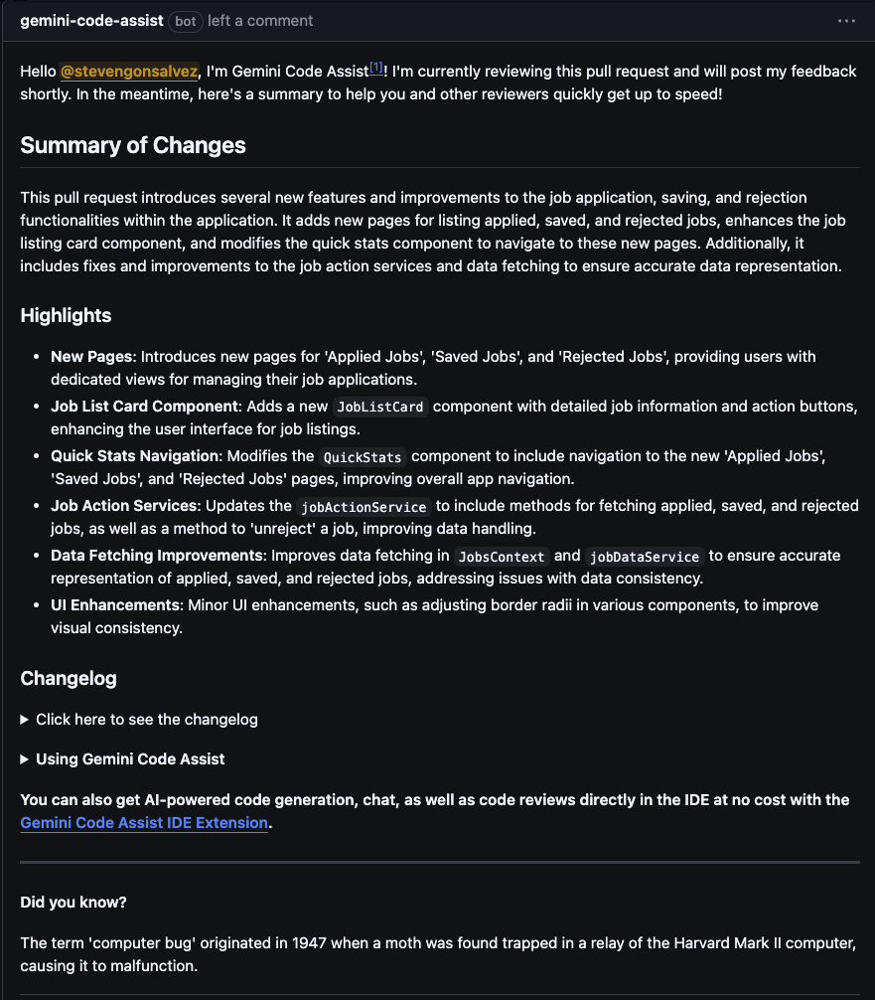

> **Missed Part 1?** This piece builds on [Beyond the Hype: What Truly Makes an AI a Great Coding Partner](https://dev.to/stevengonsalvez/beyond-the-hype-what-truly-makes-an-ai-a-great-coding-partner-2i7c). Give it a skim so the inside jokes land. I’ll wait. ☕  

## Best AI Coding Tools in 2025: Cost vs Value Showdown  

If our first article asked *“What makes a great AI coding partner?”* this follow‑up screams *“Cool, but how much will it cost me—and is it worth it?”*  

Developers are living inside **Ferris Bueller’s Law of Software**: *“Code moves pretty fast. If you don’t stop and price‑shop once in a while, you could blow your entire budget.”*  

In this guide we map the free to premium landscape of AI development tools, spotlight the quirks that make each product lovable (or rage‑quit inducing) and wrap with a monster comparison table you can attempt to make sense of.

---

### Free AI Coding Tools That Punch Above Their (Skint) Weight  

**1. Gemini AI Studio with Gemini 2.5 pro(1 M Token Context)**

Want to spin up things fast with a 1 million token context window (soon to be 2 million)? This is your jam. You can practically get small sized apps fully built in here ...completely free!!


| 📚 **Geek Corner**  cheeky hack to build an MCP server |
|:-------------------|
| **Recipe Card: Instant  build an  MCP Server**<br>1. [gitingest](https://gitingest.com/) → [TypeScript SDK](https://github.com/modelcontextprotocol/typescript-sdk)<br>2. Paste the output into Gemini chat<br>3. Add prompt + rules + Open API spec of the tool<br>4. Hit ↵ and snag `server.ts` <br> 5. Boom! Bob's your uncle|

| 📚 **Geek Corner** |
|:-------------------|
| **Big‑O Budgeting**: A 1million context sounds infinite, yet it’s still \(O(n)\) paste‑work. Remember: context ≠ competence. |

Gemini AI Studio hands you a one‑million token context on the 2 .5 Pro model, genuinely generous!. The flip side is that it remains pure chat with no agentic capabilities. So obviously, you'll be doing a bit of copy-pasting and some back and forth. It supports a few integrations (YouTube, Drive – classic Google), but it's nowhere near truly "agentic." This is pure augmentation for engineers who know their onions. Non-engineers? They'd probably give up faster than a cat in a bathtub. It’s not quite "vibe coding"; you need a plan.

**1.1. Gemini APIs**

The free tier here is *ridiculously* generous. We're talking 10-30 requests per minute (depending on the model) for their SOTA models like Gemini 1.5 Pro (1 million context, soon 2 million!) and the newer Gemini 1.5 Flash Preview (1 million context), and maybe soon 2.5 Flash as well. This means a whole universe of AI apps and agentic coding clients (Cursor, Cline, Roocode, Aider, Goose, Trae, Windsurf – you name it) can run on these APIs with BYO-AI. Sweet!

| 📚 **Geek Corner** |
|:-------------------|
| **BYO-AI (Bring Your Own API key)**: Many AI tools offer a subscription but also let you plug in your own API key from a provider like Google or OpenAI. This can sometimes be more cost-effective or give you access to models the tool doesn't offer by default. It's like bringing your own fancy engine to a go-kart track. |

**1.2. Other Google Goodies**

* **Google Code Assist (Workspace Add-on/IDE extension):** Free for a whopping 180,000 lines a day (or thereabouts). It's not the an agentic beast, but think of it as autocomplete on steroids: function completion, interactive chat with code files, the works. Useful for that everyday grind.
* **Google Code Assist GitHub Bot for PR Reviews:** This thingie is *smashing*. Absolutely free PR reviews (summaries, inline suggestions and the whole lot), and I haven't hit any limits yet. Works for private and public repos. The reviews are solid, especially for JavaScript and Python. And get this – it even adds in some trivia in the reviews. I’m a sucker for that kind of fun. A definite recommend, especially when other PR review tools ([Coderabbit](https://www.coderabbit.ai/), [Bito](https://bito.ai/),[sourcery](https://sourcery.ai/)) cost an arm and a leg.




**2. GitHub Copilot (Free Tier)** 

(Now practically baked into VSCode). The free version of Copilot? Meh. It's good, but *fairly* limited. You get about 50 "agentic" requests per month. Really? Fifty? That’s not "free," that's a "please buy me" sample. It's barely enough to explore the tool, let alone get any serious work done. The code completion (the "autocomplete on steroids" part) is a bit more generous with around 2000 completions, which might last you a week if you're frugal.  

---

## From Free-ish to Mid-Range: Investing a Little for a Lot More

#### 1. GitHub Copilot **Pro** — ~£8/mo  

Continuing with GitHub, the Pro version is probably the cheapest of the dedicated coding assistants at **$10/month for 300 "advanced" requests**. From my usage, it’s still a bit subpar to the likes of Cursor and Windsurf when it comes to precision, usage flow and "agentic" IDE capabilities, and definitely a notch below opensource plugins like Cline or Roocode.

However, two features are genuinely impressive and pretty unique right now:

* **Integrated Voice Plugin:** You can literally *talk* to your code editor chat. The speech recognition, which uses a local model, is brilliant. Seriously, it's top-notch.
* **Accessibility - Text-to-Speech:** VSCode can read out explanations from the chat (`vscode://settings/accessibility.voice.autoSynthesize`). This is fantastic if you don't want to squint at your screen or if you're multitasking. Bonus: you can set up a keyword kickoff like "Hey Code," and its pickup is often better than "OK Google" or "Hey Siri."

And a second brilliant thing: it automatically picks up my MCP server config that I've set up for Claude Desktop. *Boom!* That’s some seriously improved developer experience (DevX) compared to fiddling with different MCP JSON configs for every darn tool. Before you know it, you’ve got MCP JSON sprawl – it's a real condition, look it up (okay, don't, I made it up, but it *feels* real).

| 📚 **Geek Corner** |
|:-------------------|
| **MCP (Model Context Protocol)**: A standardized way for AI tools to discover and interact with capabilities offered by other tools or services. Think of it as a universal translator and remote control for AI agents, allowing them to use external "limbs" like web browsers, file systems, or even other AIs. It's key for building more complex agentic systems. [Find out More](https://dev.to/stevengonsalvez/introduction-to-model-context-protocol-mcp-the-usb-c-of-ai-integrations-2h76) on the MCP series |


#### 2. Cursor / Windsurf

I'm lumping these two together because they occupy a similar space in my mental AI map.
* **Cursor:** A bit superior in my tests and overall feel. It’s slightly pricier at **~£15/month for 500 "premium" requests** (GPT-4 , claude sonnet3.7 and similar level).
* **Windsurf:** Costs **~£11/month for a similar 500 requests**.

I felt that doing roughly the same agentic tasks (Windsurf calls this "cascade"), Windsurf burned through requests faster. It's a bit chattier and tends to over-explain basic stuff, which is sometimes welcome, but often you just want it to get on with it. So, the pricing might even out in the end.

Beyond the initial quota, usage is priced similarly. Cursor has per-call overages, which feels more transparent. Windsurf offers slabs like $10 for an extra 250 requests. And, of course, if you're hitting top-tier reasoning models like GPT-4.5 Turbo or  O3, those chew through your request credits faster (like 2 or 3 "requests" per actual call).

**A word of warning on Cursor's "slow requests":** Once you burn through your 500 premium requests, you get relegated to "slow" mode. It's not *too* bad if you're a night owl, an early bird, or coding during a siesta. But during peak times? The throttling on slow requests is unbearable. There was this one time, in a fit of situational anxiety and slow-request-induced frustration, I accidentally snipped my headphone wires. Turns out, using wire cutters as a fidget toy is a *terrible* idea. Don't be like me.

---

## The Chat Platform Contenders: More Than Just Talk?

Let's look at the big chat platforms and how they fare as coding sidekicks.


**Microsoft Copilot (the general one):** 

Honestly, it's a bit of an afterthought and so janky for serious coding unless you're deep in the Microsoft 365 ecosystem with Copilot Studio, which grants agentic powers within the Office suite. For standalone coding? Nah, give it a miss. It's like bringing a spork to a sword fight. 

 💰 **£20/mo** for the full suite, but coding features are more of a bonus than a core offering.

<br>

**Gemini Chat (Advanced/Pro versions):** 

Pretty much mirrors what the AI Studio offers in terms of coding grunt. The "Canvas" feature is cool for iterative code writing, maybe a bit cleaner than ChatGPT or Claude for previewing. That 1 million token context is a beast for prototyping decently complex web apps. But, it can't really integrate *outside* its sandbox (no backend for frontend calls to live APIs, for example). Still, solid for prototyping.

>It also has other brilliant features like **DeepResearch** (Google's research capabilities are hands-down the best) and audio overviews with **NotebookLM**. You can do some fascinating stuff like creating your own agentic podcast or audiobooking your notes. Not strictly coding, but cool nonetheless. For coding, Gemini 2.5 Pro's reasoning is arguably more advanced than Claude 3.7 Sonnet's (Anthropic's "thinking" model). That said, Open AI o3 (and maybe GPT-4.5) still pip Gemini 2.5 Pro in some hardcore coding benchmarks (SWE-Bench, HLEval) – but the price difference is also monstrous. And this is not mentioning the 1 TB of storage you get with the pro offering. The pro from google packs a punch
    
💰 **£19/mo** for Gemini Advanced, which includes the full suite of features including the 1TB storage, advanced reasoning capabilities, and all the research tools. The free tier is quite generous too, with access to Gemini 1.5 Pro , a decent amount of 2.5 pro and other features.


**ChatGPT (Plus)** 

The context window is smaller (around 128k for GPT-4 Turbo, though it feels like it performs best with less), but it compensates with a broader range of integrations. The biggest downer? Neither ChatGPT nor Gemini Chat (the web UIs) properly support MCP out of the box.

ChatGPT Pro lets you build **Custom GPTs**, which is a somewhat horrible, janky way to integrate with external tools via APIs. It *kinda* works like MCP if you set it up meticulously, but you can only integrate one main tool per Custom GPT. So, you'll spend an eternity setting them up, with no versioning or proper management. You’ll age faster than milk in the sun.

The standout feature? Integration *from* ChatGPT *into* apps. Relevant to coding, it can connect to VSCode/Cursor/Windsurf, text editors, terminals/iTerm, Android Studio/Xcode. The gotcha with IDEs: it can only access *one file at a time*. Yes, you read that right. One. Single. File. So, its context is limited, but at least changes can be propagated back to the tool (e.g., VSCode). The iTerm integration is one-way: ChatGPT can read everything in iTerm but can't execute commands. That would have been *smashing*, but alas.

💰 **£20/mo** for ChatGPT Plus


⭐⭐⭐ **Claude Desktop: The Reigning Champion (In My Book)**

This is my **top dog**, my go-to. It holds its own even against purpose-built IDEs. From "vibe coding" completely new projects agentically to making surgical patches in relatively large codebases (think ~200K lines of code), Claude Desktop is where it's at. Most agentic tools turn stupid or non-agentic *real fast* with codebases over 500K lines, or you just get AI slop if you don't switch from vibing to using it as a glorified assistant.

| 📚 **Geek Corner** |
|:-------------------|
| **Vibe Coding**: Coding by feeling and letting AI guess along with you. It's fun — until it isn't, and the AI starts hallucinating features you never asked for, like a rogue interior decorator suddenly deciding your app *needs* more glitter. |

It has "full" MCP support (I say "full," but as an MCP client, it still doesn't support crucial parts like sampling, discovery, or notifications, which is a bit sad considering Anthropic pioneered MCP). Yet, it's still the best implementation I've used. Bolster it with context, rules, state, task management, and efficient prompting, it’s probably as good as, if not better than, any on this list for complex, iterative development.

💰 **Pricing:** The pricing model is straightforward - **£18/month** for unlimited access to Claude 3.7 Sonnet (and few other integrations and usability features)


> **Things that Stand Out (Claude Desktop):**

For *18 quid a month* get a ridiculous amount of usage compared to other tools. It’s not measured in tokens directly, but in "messages" based on context window usage, resetting every 5 hours. If you're vibing hard in a single chat window, the entire history gets added to the 200K context window of Claude. So, you'll hit the message limit pretty quickly – maybe within 40 minutes of intense agentic use with Sonnet.

*Pro-Tip for Optimizing Claude Usage:* Keep conversations small. Start new chats frequently, letting it re-read project state if needed, rather than continuing one massive thread. You can stretch your usage to almost twice or thrice that window – so, 2-3 hours of solid work within a 5-hour block ain't bad. When throttled on Sonnet, you can still use Haiku. Haiku is surprisingly solid for churn tasks: fixing TypeScript errors, making GitHub Actions pipelines, extracting code into common functions. Just don't ask Haiku to make changes to code related to state management; it gets lost worse than Windows searching for printer drivers.


| 📚 **Geek Corner** |
|:-------------------|
| **Claude vs Cursor: Token Math** |
|To put this into perspective with Cursor: Cursor's $20 gets you 500 premium requests. If each request uses Claude's max token size (let's say for a big operation, though it's usually less, but for argument, assume 10K tokens for a Claude 3.7 Sonnet equivalent call via API that Cursor might make for complex tasks), that's 500 × 10,000 = 5 million tokens for the *entire month*.<br><br>With Claude Desktop, I'd estimate I'm getting something closer to 2–3 million *tokens per day* with smart usage. It's not a direct comparison, I know, but the cost-value proposition for producing working software is just miles ahead with Claude Desktop. |
* **Moderation:** The level of moderation in Claude Desktop is impressive. As I wil cover in the next part of [the MCP series](https://dev.to/stevengonsalvez/introduction-to-model-context-protocol-mcp-the-usb-c-of-ai-integrations-2h76), MCP can be a massive attack vector. Pretty much every other tool that supports MCP falls on its face and is ridiculously easy to compromise. Claude Desktop holds its own; there's some solid moderation happening under the hood.
* **Claudesync:** This is a super handy companion tool. It helps save a lot of time from MCP reading and making sense of your project by offering compression and other smarts.

---

## The BYO-API Crew: Maximum Control, Maximum Tweaking

These tools generally don't have their own models; you plug in your API key (OpenAI, Anthropic, Google, etc.), often via OpenRouter for more flexibility.

**Continue.dev:** 

Haven't used this one recently enough to rank it on current efficiency or cost. But it was one of the first semi-agentic tools I had in my VSCode. It supported lots of integrations with function calling (like browser fetching, Jira integration – key SDLC stuff) even before MCP was mainstream. I'll probably give it another shot and update my thoughts.

 **Roocode & Cline** 
 
 Roocode was a fork of Cline, born out of community demand (the power of open source, eh? Like when a popular mod becomes its own game). The core mechanics are similar. Cline is rock-solid, but Roocode has enhanced system management and DevX.

* **Roocode's Boomerang Task Management:** This is superb. Saves you from needing yet another tool like [taskmaster](https://www.task-master.dev/) or managing tasks externally for MCP. Roocode also makes tweaking system prompts dead easy, which is crucial because, let's be honest, many of these IDE tools are just fancy prompt engineering and context fetching wrapped around VSCode.
* **Cline:** Being open source, it's also fairly easy to tinker with system prompts (something you can't easily do in Cursor/Windsurf).

> **Standouts for Cline & Roocode:**
* **Pair Programming Feel:** These tools, especially with their different interaction modes, genuinely feel more like pair programming. They ask intelligent questions back, making you feel they *understand* the code structure and composition. No sudden "let's go nuclear and rewrite everything!" suggestions that you sometimes get from Cursor or even Claude Desktop when they're having a moment.
* **Controllable Context:** There's no hard context limitation, or rather, it's controllable. This applies to both reasoning and non-reasoning models. You can even mix and match models for different tasks (e.g., DeepSeek for reasoning/architecture and Claude Haiku for dev/debug modes) to slash costs. Because of better context handling, you often get fewer hallucinations and more precise suggestions.
* **Cline's MCP Marketplace:** Cline has a slight edge with its MCP marketplace. That said, there are MCPs to install MCPs these days, so it's a bit like Inception.


💰 **Pricing:** Since you bring your own API key, the cost is entirely usage-based. Cline and Roocode are highly optimized for context stuffing and iterative problem-solving, but that means you can easily burn through tokens at a rapid pace. If you're not careful, you could be spending at the rate of **£20 an hour** (or more) during heavy, agentic sessions—especially with premium models like Claude or GPT-4. The upside: you have maximum control and flexibility. The downside: your bill can spike fast if you let the models chew through large contexts or run lots of multi-step tasks. For most devs, it's wise to keep an eye on your API dashboard and set usage caps if possible.


| 📚 **Geek Corner** |
|:-------------------|
| **The Billion-Dollar Prompt Club:** Ever wonder what’s really under the hood of your favorite “AI-powered” dev tool? Spoiler: it’s mostly a glorified Mad Libs for nerds. Take a peek at [this repo](https://github.com/x1xhlol/system-prompts-and-models-of-ai-tools/tree/main) and you’ll find that the secret sauce is just a pile of elaborate system prompts (with a bit of extra packaging and polish). Billions in valuation, and the magic is… really, really good prompt engineering. Somewhere, a prompt engineer is cackling while investors nod sagely at a 200-line YAML file that says “Act like a helpful coding assistant, but with more emojis.” |


---

### Aider: The CLI Powerhouse

This is my close second favorite, maybe even my first on some days. Aider is **not agentic**. It's a pure, unadulterated CLI-based augmented AI coder. No bells, no whistles, just brilliant execution. And it’s a CLI! Who doesn’t love a CLI that actually *works* and makes you feel like a wizard?

| 📚 **Geek Corner** |
|:-------------------|
| **Agentic vs. Augmented AI**: **Augmented AI** helps you with specific tasks (e.g., "write this function," "find this bug"). **Agentic AI** can take broader goals ("refactor this module for performance," "build a user auth system"), break them down into steps, and execute them, often interacting with tools and your codebase more autonomously.|

**Things that Stand Out (Aider):**

* **Context Fetching:** Easily the best of the bunch. Cline and Roocode use similar methods treesitter and ripgrep, but Aider really gets it right. In comparison, Cursor, Windsurf, and other VS Code-based tools rely on VectorDBs and perform NN style searches on vectors. From experience, I can confidently say that treesitter combined with  *some form of* fuzzy search consistently outperforms vector search approaches.
* **CLI FTW!:** Being a CLI, you can wrap it, automate the automation, build bots – the sky's the limit. You could build your own auto-PR bot for small bug fixes. Imagine: Aider fixes a bug, then Google Code Assist Bot reviews it... *evil laugh*.
    (Here's one I whipped up earlier: https://github.com/stevengonsalvez/patchmycode - user to fill in)
* **Aider Benchmarks:** The benchmarks Aider uses are a solid standard for ranking how well different models perform for coding tasks. From my experience using various models via OpenRouter with different tools, these benchmarks are scarily accurate to real-world experience.

💰 **Pricing:** Aider stands out as the best value among these tools. Because it isn’t agentic and is highly optimized for context fetching, it uses far fewer tokens per session than agentic tools that chew through context windows and run multi-step tasks. With Aider, your costs are almost entirely determined by the efficiency of your prompts and the model you choose—no hidden overhead, no runaway token usage. In practice, this means you can get hours of productive coding for just a few pounds or dollars, especially if you use cost-effective models like deep-seek and/or qwen.


---

## Other Players on the Field

A quick look at a few others making waves, ripples, or let’s be honest, barely noticeable bubbles no one asked for.

**Trae (from ByteDance)** 

Imagine if Cursor had a long-lost cousin who showed up uninvited to the family reunion, wearing knockoff shoes and bragging about their “innovative” ideas. That’s Trae. It’s like someone at ByteDance saw Cursor, squinted, and said, “Yeah, we can copy that badly and in a hurry!” But hey, at least Trae’s got one thing going for it: you can use it all day long because apparently, ByteDance forgot to install a proper throttle. If you’re tired of burning through your Cursor or Windsurf premium requests on actual work, just dump your busywork on Trae and let it fumble through. Is it as good as Cursor or Windsurf? Absolutely not. But it’s free, and sometimes you just need a tool that’s good enough to get the job done… or at least make you appreciate the tools you’re actually paying for.<br>

**Amazon Q** 

Oh, Amazon Q. Until recently, it was a big, sad dud. It lagged so far behind in augmented coding that CodeWhisperer (its predecessor) barely managed decent autocomplete. Single file edits, generating docs, and chatting with your current file – that was pretty much its resume. Then, the name change to Q must have brought some good fortune (or a kick up the AWS backside).
<br>The IDE plugin is still, frankly, rubbish. But the **Q CLI** (my love for CLIs is showing again!) is starting to get interesting. Amazon absorbed Fig a few years back (one of the best terminal helpers ever, written in Rust, super slick – RIP original Fig) and relaunched parts of it. The Q CLI was good for autocomplete, but that was it. Then, *boom*, out of nowhere, Q CLI became an AI CLI with agentic capabilities. The latest release even supports MCP! It feels surprisingly agentic when it gets going.

There's still a *lot* of room for improvement. Much of it is manual (setting context, rules, system prompts). It feels like a basic AI agent plugged into an LLM API with an MCP client, some pre-provisioned S3 location, and a BuilderID auth system. But it's really fast and crisp to work with. Plus, it's open source, so there's potential.

It still can't hold a candle to Aider for context handling or code fixing, but Aider isn't agentic and doesn't do MCP. So, Q CLI has its niche. There's a bit of a free tier (I think there are limits). A downer is that we don't know what models are powering it (for reasoning/planning vs. execution). All other products are fairly open about this. (Peeking at their code, Amazon uses `codewhisperer` and `amazonqdeveloper` backend APIs. `codewhisperer` seems to be for local cli use , `qdeveloper` for cloudshell). I haven't tested the difference extensively; it's likely more about context added in the backend than model differences. But I get a sneaking suspicion that some reasoning might be happening with a Claude model, and some dev tasks with a lower-capability model (Claude Haiku, maybe?). This is just observational, especially when using MCPs.

💸 **Price:** £19/month for Pro — which is bonkers considering it’s pretty half-baked compared to the competition. The free tier is a paltry 50 chats per month or something equally stingy. 

>That said, Q CLI is still probably the best *suggestive autocomplete for the terminal* out there; and that part is free. 

**GitHub Copilot CLI** 

Needs a soft mention here. For free, it's a lovely little helper utility in your terminal for complex bash completions and simple queries. Super handy.

```bash
> ?? fetch me all kubernetes pods in the namespace that is using memory more than 10GB

Welcome to GitHub Copilot in the CLI!
version 1.1.0 (2025-02-10)

I'm powered by AI, so surprises and mistakes are possible. Make sure to verify any generated code or suggestions, and share feedback so that we can learn and improve. For more information, see https://gh.io/gh-copilot-transparency

Suggestion:

  kubectl get pods --namespace=<namespace> --field-selector=status.phase=Running -o=jsonpath='{range .items[?(@.status.containerStatuses[0].usage.memory > "10Gi")]}{.metadata.name}{"\n"}{end}'

? Select an option  [Use arrows to move, type to filter]
> Copy command to clipboard
  Explain command
  Execute command
  Revise command
  Rate response
  Exit
```


There are tons of other AI thingies I use around my coding/building/dev workflow (Pieces.db is one – check it out, especially if you're an Obsidian user!), but I'll cover those in my upcoming productivity setup series.

---

## How I Actually Use Them (2025 Stack Snapshot)  

My own flow is simple: tiny scripts and quick MCP servers start in Gemini AI Studio; fresh projects get scaffolded inside Claude Desktop; mid‑sized refactors live in Aider or Cursor; and when the codebase grows into a sprawling beast I call in Roocode on OpenRouter, costly but sanity‑saving.

---

## Final Verdict: The Comparison Megatable  

| Tool | Price (USD/mo) | Context Window | Stand‑out Superpower | Sweet‑Spot Integration | Ideal For |
|------|----------------|----------------|----------------------|------------------------|-----------|
| **Gemini AI Studio** | Free | 1 M | One‑prompt app scaffolds | Web UI & API | Single‑shot prototypes |
| **Google Code Assist** | Free | ~5 K lines/file | PR jokes + solid reviews | GitHub bot, IDE | Clean pull requests |
| **Copilot Pro** | 10 | 80 K* | Voice‑driven coding | VS Code | Daily dev flow |
| **Cursor** | 20 | 200 K | Agentic IDE, smart refactor | VS Code | Complex debugging |
| **Windsurf** | 15 | 200 K | Verbose explanations | VS Code | Learning by osmosis |
| **Claude Desktop** | 20 (£) | 200 K | Massive context + MCP | Desktop app | Arch & large codebases |
| **ChatGPT Plus (GPT‑4o)** | 20 | 128 K | Plugin ecosystem | Web, IDE plugins | Glue code / multi‑tooling |
| **Aider (CLI)** | BYO | Up to model | Diff‑aware CLI | Terminal | Precise fixes & batch ops |
| **Cline / Roocode** | BYO | Unlimited* | Pair‑programming modes | VS Code | Long‑haul dev with custom prompts |
| **Amazon Q CLI** | 19 | Unknown | Agentic shells & infra | Terminal | Cloud dev & infra tasks |
| **Trae** | Free+ | 32 K | Low‑cost Cursor clone | VS Code | Cheap experimentation |

\*Copilot context via TT‑1 window; Cline “unlimited” constrained only by chosen model/token budget.  

---

### TL;DR  

Students and hobbyists should milk Gemini AI Studio alongside Google Code Assist; everyday professionals will cover ninety percent of their work with Copilot Pro plus Cursor; big‑code wranglers swear by Claude Desktop, where the price of admission is smaller than the therapy bill; and CLI devotees will find bliss pairing Aider with Amazon Q.

Parkinson’s Law says work expands to fill the time available. Trust me—**LLM bills expand to fill the credit limit available**. Choose wisely, code boldly, and keep a wire cutter far from your headphones. 🎧✂️


