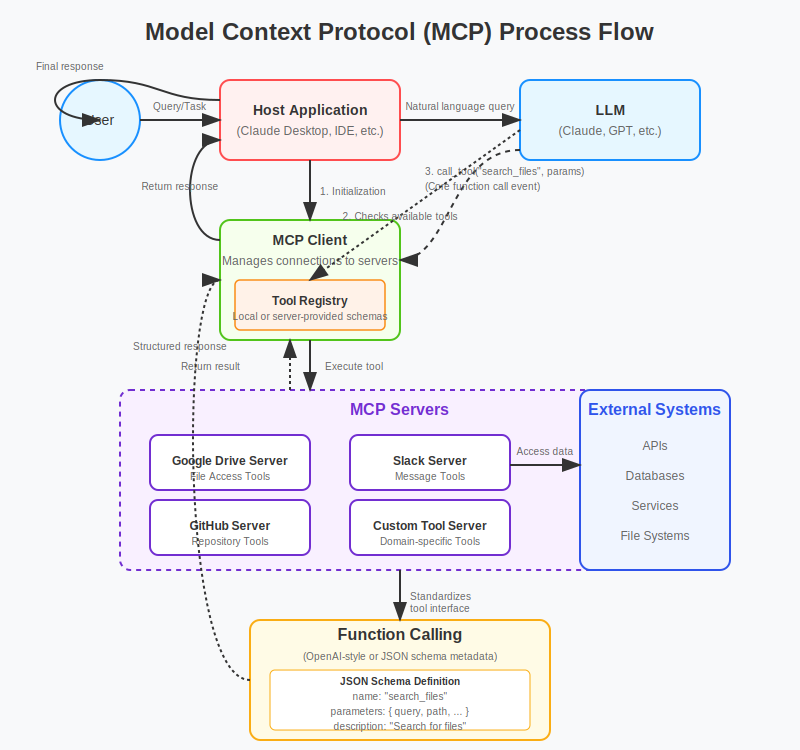
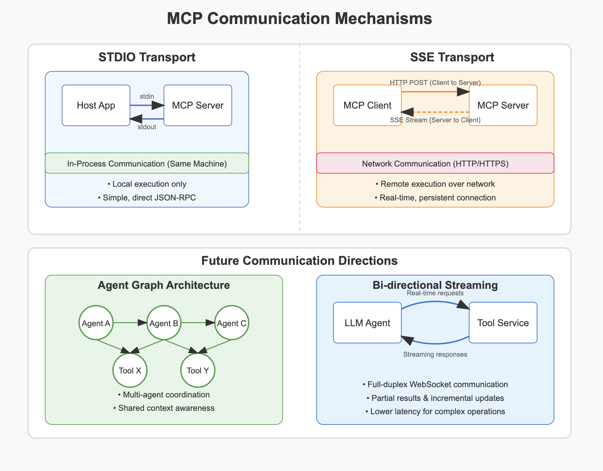

# Exploring the MCP Ecosystem: Looking Under the Hood

In my [previous article](https://dev.to/stevengonsalvez/introduction-to-model-context-protocol-mcp-the-usb-c-of-ai-integrations-3k01-temp-slug-1067875?preview=9f1f1b1bea3494c6e664e3c9ae268a2de57e51b56157980cbd0177838362410fd6c3791bffb9c3461f7a1cafc2d2b6068ae3ead99084bb5e2b3c3679), I introduced Model Context Protocol (MCP) as the USB-C of AI integrations - a standardized way to connect LLMs with external tools and data sources. Today, we're strapping on our digital spelunking gear and descending deeper into the mechanics of MCP.

Fair warning: we're about to get technical. But don't worry – even if you're not a hardcore developer, I've sprinkled in enough analogies and plain English explanations that you'll walk away with a much better understanding of how MCP actually works. So, grab your favorite caffeinated beverage and let's dive in!

## Function Calling: The Prerequisite for MCP

Before we can understand MCP, we need to address a fundamental question: **Can any LLM use MCP, or is there a prerequisite?**

The simple answer is that MCP depends entirely on a model's ability to use **function calling** (sometimes called "tool use"). If you're not familiar with function calling, it's a capability that allows LLMs to:

1. Understand available functions/tools described in JSON schema format
2. Decide when to use these functions based on user queries 
3. Invoke these functions with the correct parameters
4. Process the results returned from these functions

Think of it like knowing how to use a phone book. It's not enough to be intelligent – you need to understand what a phone book is, when to use it, how to look up entries, and what to do with the phone numbers you find.

Not all models offer this capability, and those that do support it with varying levels of sophistication. Want to see which models can handle function calling? Check out the [Berkeley Function Calling Leaderboard](https://gorilla.cs.berkeley.edu/leaderboard.html) - it's an excellent resource that ranks models based on their function calling abilities.

| 📚 **Geek Corner** |
|:-------------------|
| **Function Calling Under the Hood**:  
Let's look at an example of what function calling looks like before MCP even enters the picture:  
```javascript
// Example function definition sent to an LLM API
const functionDefinitions = [
  {
    "name": "get_weather",
    "description": "Get current weather for a location",
    "parameters": {
      "type": "object",
      "properties": {
        "location": {
          "type": "string",
          "description": "The city name, e.g., 'London'"
        },
        "unit": {
          "type": "string", 
          "enum": ["celsius", "fahrenheit"],
          "description": "Temperature unit"
        }
      },
      "required": ["location"]
    }
  }
];

// When the model decides to call this function, it might return:
{
  "function_call": {
    "name": "get_weather",
    "arguments": {
      "location": "London",
      "unit": "celsius"
    }
  }
}
```
MCP takes this foundation and builds a standardized protocol on top of it, creating discovery, invocation, and lifecycle management layers that turn a simple function call into a robust, distributed system. |

## MCP Architecture and Process Flow

Let's visualize how MCP actually works. The diagram below shows the overall process flow when an LLM uses MCP to interact with external tools:



_P.S. This rather neat SVG was conjured up by Claude. Way better than wrestling with Mermaid, wouldn't you agree? 😉_

So what's actually happening here? Conway's Law tells us that systems often mirror the communication structure of the organizations that design them. MCP is no exception – its architecture reflects the need for a standardized way to exchange data and functionality between AI models and external tools.

The process typically goes like this:

1. A user asks a question in a host application (like Claude Desktop)
2. The host initializes an MCP client, which handles connections to MCP servers
3. The MCP client discovers what tools are available and registers them in a tool registry
4. The LLM receives the user's query and checks the available tools
5. If relevant, the LLM decides to call a specific tool with parameters
6. The tool executes (accessing external systems if needed) and returns a result
7. The LLM incorporates this result into its response to the user

What makes this powerful is that it standardizes all these interactions. Instead of custom code for every integration, developers have a universal protocol. It's akin to how HTTP standardized web communications – before HTTP, connecting different systems on the internet was a custom job every time.

## Communication Mechanisms: STDIO vs. SSE

Now we get to the really interesting part – how does MCP actually transmit data between clients and servers? MCP supports two primary transport mechanisms, and choosing between them depends on your specific use case.



### STDIO Transport: The Local Powerhouse

STDIO transport uses standard input/output streams for communication. It's the simpler of the two mechanisms, but that doesn't mean it's unsophisticated.

#### How STDIO Actually Works

Many explanations of STDIO transport get this wrong, so let's be crystal clear:

1. **Two Separate Processes**: STDIO transport involves *two separate processes* – the client process and the server process.

2. **Subprocess Model**: The MCP client launches the MCP server as a child process (subprocess), establishing a parent-child relationship.

3. **Inter-Process Communication (IPC)**: The communication flows via standard input/output streams:
   - Client writes to the server's stdin pipe
   - Client reads from the server's stdout pipe
   - The operating system manages these pipes between processes

4. **JSON-RPC Over Pipes**: Messages are formatted using JSON-RPC 2.0, providing a structured way to make remote procedure calls.

| 📚 **Geek Corner** |
|:-------------------|
| **The STDIO Implementation**:  
Here's a simplified example of how an MCP client might start and communicate with an STDIO-based server in Node.js:  
```javascript
const { spawn } = require('child_process');
const { v4: uuidv4 } = require('uuid');

// Launch the MCP server as a subprocess
const serverProcess = spawn('./mcp-server', ['--option', 'value']);

// Set up message handling
serverProcess.stdout.on('data', (data) => {
  const message = JSON.parse(data.toString());
  handleServerResponse(message);
});

// Send a request to the server
function sendRequest(method, params) {
  const request = {
    jsonrpc: '2.0',
    id: uuidv4(),
    method,
    params
  };
  
  serverProcess.stdin.write(JSON.stringify(request) + '\n');
}

// Example: List available tools
sendRequest('tools/list', {});

function handleServerResponse(message) {
  console.log('Received response:', message);
  // Process the response...
}
```
This pattern closely follows the Unix philosophy of composability – small, simple programs that do one thing well and can be connected together. By using standard streams, MCP leverages decades of operating system design principles for robust inter-process communication. |

STDIO transport is ideal for:
- Local development environments
- Accessing sensitive local resources (files, databases)
- Simple integrations without networking complexity
- Tools that need direct access to the local system

However, this approach has limitations – notably, it only works on the same machine. For remote connections, we need something else.

### SSE Transport: The Remote Connector

Server-Sent Events (SSE) is the second transport mechanism MCP supports, enabling remote communication over HTTP. This is where things often trip people up with MCP — and for good reason, so let's break it down in detail.

#### How SSE Actually Works in MCP

SSE creates a half-duplex communication channel that allows servers to push data to clients. The clever part of MCP's implementation is how it creates full-duplex communication:

1. **Separate HTTP Connections**: 
   - Server-to-client communication: Persistent SSE connection
   - Client-to-server communication: Standard HTTP POST requests

2. **Session Management**:
   - When a client connects, it establishes an SSE connection to the server
   - The server assigns a unique session ID for this connection
   - All future HTTP POST requests from the client include this session ID
   - This allows the server to associate POST requests with the correct SSE stream

3. **JSON-RPC Over HTTP**:
   - Just like with STDIO, all messages use JSON-RPC 2.0 format
   - Messages from client to server go via HTTP POST
   - Messages from server to client go via the SSE stream as event data

| 📚 **Geek Corner** |
|:-------------------|
| **SSE Implementation**:  
Here's a simplified Python example using FastAPI to implement an SSE-based MCP server:  
```python
from fastapi import FastAPI, Request, Response
from sse_starlette.sse import EventSourceResponse
import uuid
import asyncio
import json
from typing import Dict

app = FastAPI()

# Store active connections
connections: Dict[str, asyncio.Queue] = {}

@app.get("/sse")
async def sse_endpoint(request: Request):
    # Create a unique session ID
    session_id = str(uuid.uuid4())
    
    # Create a queue for this connection
    queue = asyncio.Queue()
    connections[session_id] = queue
    
    # Send the client its session ID
    await queue.put({
        "event": "session_id",
        "data": session_id
    })
    
    # Return SSE response
    async def event_generator():
        try:
            while True:
                # Wait for messages to be added to the queue
                message = await queue.get()
                
                if message.get("event") == "close":
                    break
                    
                yield message
        finally:
            # Clean up when connection closes
            if session_id in connections:
                del connections[session_id]
    
    return EventSourceResponse(event_generator())

@app.post("/messages")
async def post_handler(request: Request):
    data = await request.json()
    session_id = request.query_params.get("session_id")
    
    if not session_id or session_id not in connections:
        return Response(status_code=404)
    
    # Process the JSON-RPC request
    result = process_jsonrpc_request(data)
    
    # Send response via SSE
    await connections[session_id].put({
        "event": "message",
        "data": json.dumps(result)
    })
    
    return {"status": "ok"}

def process_jsonrpc_request(request):
    # Process the JSON-RPC request and return result
    # This would handle methods like tools/list, tools/call, etc.
    # ...
    return {"jsonrpc": "2.0", "id": request["id"], "result": {}}
```
This approach is reminiscent of the "long polling" techniques used before WebSockets became widespread. By combining a persistent SSE connection with standard HTTP POST requests, MCP achieves bidirectional communication without requiring more complex WebSocket implementations. |

The SSE transport is perfect for:
- Remote MCP servers (cloud-hosted)
- Multi-tenant scenarios where many clients connect to one server
- Public-facing MCP services
- Enterprise deployments across different machines

Each transport mechanism has its own strengths and use cases, and MCP's flexibility in supporting both is part of what makes it powerful.

| 📚 **Geek Corner** |
|:-------------------|
| **The Transport Protocol Zoo**:  
While we're on the subject of transport protocols, it's worth noting how MCP's choices compare to other options out there:

| Protocol | Bidirectional? | Persistent? | Browser Support | Advantages | Disadvantages |
|----------|---------------|------------|----------------|------------|--------------|
| **STDIO** | Yes | No | N/A | Simple, fast, secure for local | Local only, short-lived |
| **SSE** | Half-duplex* | Yes | Excellent | Reliable, auto-reconnect, works with HTTP | Client-to-server needs separate channel |
| **WebSockets** | Yes | Yes | Excellent | Full-duplex, efficient | More complex, harder to debug |
| **gRPC** | Yes | Optional | Limited | High performance, type safety | Browser support issues, higher complexity |
| **GraphQL** | Partial\* | No | N/A | Flexible queries | Not designed for bidirectional |
| **MQTT** | Yes | Yes | Via libraries | Lightweight, pub/sub model | Overkill for many use cases |


*MCP compensates for SSE's half-duplex nature by combining it with HTTP POST requests.  
The transport protocol choice always involves tradeoffs. MCP's support for both STDIO and SSE strikes a good balance for most use cases, though as we'll see, there are some interesting future directions that might expand these options. |

\*GraphQL itself is request-response, but GraphQL over WebSockets (subscriptions) enables bidirectional communication. MCP does not currently use GraphQL.


## Future Directions: What's Next for MCP?

### OAuth 2.1 Authorization: Securing the AI-Tool Interface

Up until now, MCP communication has focused primarily on transport and protocol standardization — but there was one glaring gap: **authorization**.

Previous MCP setups either relied on:
- Implicit trust between agents and servers (local deployments)
- Custom authorization headers and ad hoc token checks
- Manual API key embedding (you know, that one `config.py` file we all pretend isn't a security risk)

This might have been passable in early local dev setups, but it breaks down fast in real-world deployments, especially when:
- You’re dealing with multi-tenant services
- Different tools have different permission scopes
- You're invoking external APIs that require delegated access

**Enter OAuth 2.1.**

With the [2025-03-26 MCP spec](https://modelcontextprotocol.io/specification/2025-03-26/basic/authorization), we now get proper, standards-compliant authorization:
- **OAuth 2.1 support**: Servers can now act as both resource servers *and* authorization servers
- **PKCE flows** and **dynamic client registration** allow secure token-based communication
- Clients can authenticate, request access tokens, and call tools based on fine-grained scopes
- Tool servers can validate tokens (JWTs or introspection), and even delegate to third-party auth providers

This allows MCP to move from local toy setups to serious, secure multi-agent environments — where tools can declare their required permissions, clients can ask for just what they need, and the whole exchange is governed by proper access control.

| 📚 **Geek Corner: OAuth, but Make It Agentic** |
|:---------------------------------------------|
| You might be wondering: "Wait, isn't OAuth just for login buttons?"  
Not quite. OAuth is a delegation framework — it's how your AI agent can say:  
_"Hey, I want to access this weather API — but only to read temperature, not to change server settings."_  
With proper scopes, token validation, and consent flows, we're finally moving past the era of hardcoded `service_key=XYZ123` in plain-text files. MCP doesn't reinvent security — it just finally plugs into the system the web already trusts. |


### Streamable HTTP: Simplifying Bi-Directional Transport

Until recently, remote MCP communication required using two endpoints:
- One for establishing a persistent SSE connection (`/sse`) so the server could push updates back to the client
- Another for sending tool call requests (`/sse/messages`)

While functional, this setup was awkward — like holding two phones at once: one to talk, one to listen. It introduced complexity, required clients to maintain long-lived connections, and increased the risk of missed messages during network hiccups.

**Enter Streamable HTTP.**

This new transport simplifies everything by enabling:

- **Single endpoint communication**: All interaction now flows through a single `/mcp` endpoint, greatly reducing overhead.
- **Bi-directional exchange**: Servers can respond and push updates on the same connection, enabling richer interactions — like prompting the client for more input or streaming back partial results.
- **Dynamic upgrades**: A tool call begins as a regular POST, but the connection can seamlessly upgrade to an SSE stream if needed — for example, to support long-running operations.

With Streamable HTTP, if an AI agent invokes a tool, it sends a single request to `/mcp`. The server can respond immediately or, if the task is lengthy, upgrade the connection to stream responses in real time.

While current implementations match SSE's feature set, the spec allows for more: resumability, cancellability, and session tracking — all of which are on the roadmap.

Check out the [official MCP specification for Streamable HTTP](https://modelcontextprotocol.io/specification/2025-03-26/basic/transports#streamable-http) for the latest developments.

The Model Context Protocol is still evolving, and there are several exciting developments on the horizon that could reshape how AI models communicate with tools and each other.


### Agent Graph Architecture

One of the more interesting directions emerging in the MCP community is the idea of “agent graphs” — proposed architectures where a proxy or aggregator node can sit on top of multiple MCP servers, creating a hierarchical mesh of tools and services.

This came up in a [recent GitHub discussion](https://github.com/modelcontextprotocol/modelcontextprotocol/discussions/94), where the community debated how to manage scenarios in which:
- A single MCP client needs to interact with many tool servers
- Multiple tool servers need to be composed or queried through a single interface
- Tools may be discovered dynamically from downstream agents

This introduces a classic architecture challenge: how do you **maintain the simplicity of MCP**, while allowing it to support complex topologies of tools and agents?

A few patterns were proposed:

- **Proxy/Aggregator pattern**: A single MCP server acts as a proxy to many others, routing tool calls downstream.
- **Hierarchical namespacing**: Using naming conventions like `@agent-name/tool-name` to avoid collisions between tools from different servers.
- **Discovery-layer solutions**: Instead of baking the graph into MCP’s core, allow clients to resolve tool routes dynamically at runtime.

There’s clear utility here — especially in enterprise settings where you might have thousands of downstream tool endpoints. But it also raises open questions: Who manages the registry? How do you version tools? Can a tool call be dynamically routed across multiple backends?

| 📚 **Geek Corner: Graphs of Agents, Not Just Tools** |
|:---------------------------------------------------|
| Think of this like microservices — but for AI tools.  
Instead of hardcoding every tool in every agent, you could have a shared MCP proxy layer that routes requests smartly based on context, scopes, or even performance.  
This would allow teams to build modular, swappable agents with their own toolchains — while clients only need to point at a single MCP proxy. That’s the dream. |

>There exists already few implementations like [mcp bridge](https://github.com/SecretiveShell/MCP-Bridge/tree/master?tab=readme-ov-file#sse-bridge) or [mcp hub](https://github.com/ravitemer/mcp-hub) , but they are more janky sticky plaster - opens out other problems like human in the loop, approval, state management etc. 

### Protocol Convergence

There's also movement toward convergence between different agent/tools/model communication protocols:

- MCP (Model Context Protocol) - Connects models to tools
- [ACP (Agent Communication Protocol)](https://agentcommunicationprotocol.dev/introduction/welcome) - Enables agent-to-agent collaboration
- [A2A (Agent-to-Agent)](https://developers.googleblog.com/en/a2a-a-new-era-of-agent-interoperability/) - Focuses on discovery and negotiation between agents

While each has its strengths, the lines between them are blurry. We're likely to see either convergence or clearer specialization in the coming days, as the agent ecosystem matures.

Will explore agent communication in another post, with some examples.

| 📚 **Geek Corner** |
|:-------------------|
| **The Future of Agent Communication**:  
According to Denise Holt's analysis on "The Future of Agent Communication," the emerging protocols all face a common evolution:
- Current protocols like MCP are "point-to-point" in architecture
- Future systems will likely evolve towards a "Spatial Web" approach where "context, state, and interactions are externalized into a distributed, permissioned map of all relevant entities and relationships"  
This parallels the evolution we saw in web development:  
- First, we had simple RESTful APIs (point-to-point)
- Then came GraphQL for more relational/graph-based data access
- Now we're seeing fully graph-based architectures emerge  
As Holt puts it: "Agents don't pass context around; they live inside it." This vision points to why protocols like MCP may evolve from being merely message-passing systems to become part of a richer semantic web of agent interactions. |


## Gaps from the Ground: What's Missing for Enterprise-Grade MCP?

As exciting as MCP is — and as much progress has been made — we need to talk about what's not there yet. From where I stand, the protocol still feels more startup-native than enterprise-ready. The cowboy spirit of "just wire it up and ship it" works great in lean, fast-moving teams — but for large organizations with security, compliance, and audit requirements, MCP has a long way to go.

Here are some of the biggest gaps I see that could block full-scale adoption:

### 1. Governance and Traceability

Right now, there's no standardized way to control which tools get registered, who can invoke them, or track their usage across the organization. Imagine a registry that includes validation of tool sources, signatures, metadata about authorship, and full audit history of usage. Until that exists, most enterprises will struggle to wrap governance policies around their MCP deployments.

### 2. Security (Token Theft, Tool Poisoning, Prompt Injection…)

MCP creates powerful access patterns — but also dangerous ones. You're essentially plugging AI agents into remote-executable interfaces with live tokens and external access. The attack surface is wide:
- Prompt injection via tool names or parameter crafting
- Tool poisoning (malicious tools returning compromised outputs)
- Exfiltration via overly-permissive tool scopes
- Token theft from compromised servers or clients

Right now, there’s a real lack of standard practices around mitigating these risks — especially things like fine-grained permission enforcement, sandboxed tool execution, or secure output validation.

### 3. Observability and Monitoring Are Primitive

You wouldn’t run a microservice architecture without distributed tracing. But with MCP? Most setups today have zero structured observability. You might see logs. Maybe. There’s no native support for:
- Tracing calls from model to agent to tool and back
- Monitoring anomalous patterns or response times
- Understanding how prompt context impacted tool selection

This is a huge gap. Some platforms like LangSmith are exploring solutions here, but it’s early days.

### 4. Immature Testing Frameworks

Most of the top open-source MCP servers out there? They’re tested manually. If you’re lucky, they might have some Jest or PyTest scaffolding. But you won’t find full regression suites, load tests, fuzzers, or attack simulations. The lack of automated acceptance, performance, and security testing is a red flag for production-grade deployments.

### 5. Ecosystem Fragmentation

The MCP ecosystem is promising but still fragmented. Many popular apps don’t have official MCP servers. Rate limiting and sync throttling are often left to the developer. Implementations vary widely in structure and quality. This creates a barrier to confidence and scalability.

### 6. Authentication and Access Control Are Still Ad-Hoc

The 2025 spec introduces OAuth 2.1 — and that’s a big step. But adoption is still inconsistent. And even with OAuth, most setups lack things enterprises are used to:
- SCAMP-like container policies
- Namespace-level controls
- Delegated scopes and granular claims
- Expiring access windows
- Real-time access revocation
Without these, the trust model remains fuzzy.

### 7. Tool Isolation and Threat Prevention

Enterprises need zero-trust environments, especially when agents execute external tools. But currently:
- Tools can access global context without controls
- Tool responses can be spoofed or poisoned
- Agents have no ability to introspect whether a tool was trusted or sandboxed

We need better runtime enforcement here — maybe something akin to CSPs in web apps or AppArmor for tools.

### 8. Debugging Is... Painful

If something breaks in a multi-agent + multi-tool flow, good luck. You’ll likely find yourself tailing logs, watching sockets, and hoping for the best. Structured debugging support — like stack traces for agents or session snapshots — just doesn’t exist yet.

### 9. Data Privacy and Policy Gaps

Most enterprise teams have strict DLP (data loss prevention) rules. MCP makes this tricky, especially when tools pull from sensitive stores. There’s no standard way to label or restrict data within MCP flows. And once the model sees it, it’s already out of the barn.

### 10. Cowboy Energy Everywhere

This one's more cultural than technical — but it matters. Right now, MCP is moving fast, evolving quickly, and driven by highly capable indie contributors and startups. That’s amazing — but it also means few systems are hardened, few patterns are agreed upon, and very few setups are reproducible out of the box.


| 📚 **Geek Corner: The Parallels with Early Docker** |
|:----------------------------------------------------|
| If you remember the early days of Docker (circa 2014), you’ll recognize the vibes:   
- Demos were magical.  
- Security teams were horrified.  
- Devs loved it. Enterprises waited.  
That’s where MCP is today. It’s powerful, flexible, and pushing boundaries — but without the right guardrails, it's a little too easy to shoot yourself in the foot with it. |

I'll be covering some of these gaps — especially around security risks, ethical hacking demonstrations, and how to build safer, wrappers around existing MCP implementations — in a future post in this series. Stay tuned.

If you're in a large company looking to use MCP, don't let this list scare you — let it guide your architecture.  
Build wrappers. Build policy engines. Monitor everything.  
And more importantly, contribute back — because this ecosystem needs both velocity and voices of caution.

## Conclusion: The Road Ahead

MCP represents a significant step forward in how we connect AI models with the digital world. By standardizing these interactions, it's enabling a new ecosystem of tools and capabilities.

In my next article, we'll get even more practical by building our own MCP client and server, exploring real-world use cases, and seeing how MCP can solve common integration challenges.

Until then, I encourage you to explore the MCP specification, try out some of the existing MCP servers, and consider how this protocol might simplify your own AI integrations. The future of AI isn't just about smarter models – it's about better-connected ones.

*Have questions about MCP or suggestions for future topics? Drop a comment below!*
