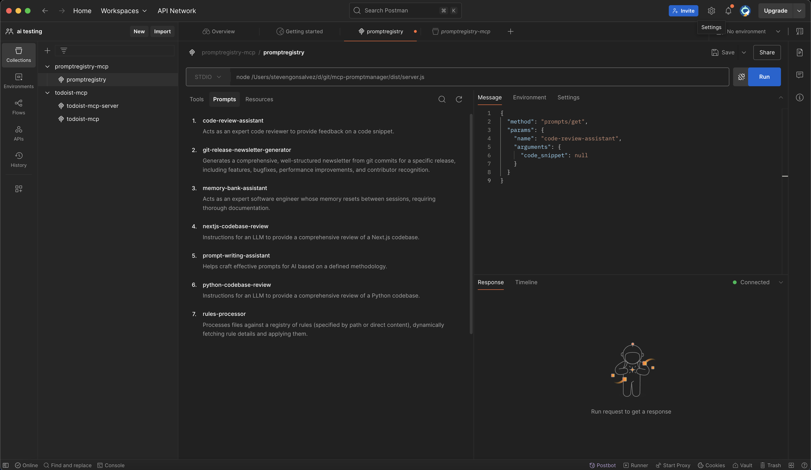

# Building Your Dev-Centric Prompt Server with MCP 🏰✍️


Ever spend half your morning hunting for that one magic prompt, the little line of text that turns gnarly legacy code into poetry or squashes an epic PR down? One minute it’s in front of you, the next it’s gone. Maybe it’s hiding in `notes_final_v3.md`, lost in a Slack thread, or buried in a comment from a project you barely remember. Tracking down lost prompts can feel less like coding and more like finding a lego brick in my daughter's playroom. 

The AI landscape is dotted with powerful prompt registries. Tools like Langfuse, Helicone, Portkey, and many others are the heavy artillery, essential for teams building dedicated AI applications where prompt versioning, A/B testing, rigorous evaluations, and collaborative workflows are paramount. They are the Fort Knoxes of prompt management.

But for us, the humble (or not-so-humble) software developers, wielding LLMs as a versatile tool in our daily coding arsenal, these enterprise-grade solutions can sometimes feel like using a supercomputer to calculate my tax(maybe needed, with the complexity of the taxcodes in the country). It's overkill for quickly iterating on a prompt to help write a commit message or draft an email. Parkinson's Law of Triviality (bikeshedding) often meets prompt management: the time spent setting up and managing a prompt in a complex external system can dwarf the time saved by using the prompt itself for simple tasks.

What if our prompts lived closer to home? What if they were integrated, personal, and yet spoke a universal language understood by our favorite dev tools, whether that's Claude Desktop, Cursor, a nifty CLI, or even `cat | llm-cli`?

This is where the **Model Context Protocol (MCP)** steps onto the stage, offering standardization.

## MCP: Your Babel Fish for LLM Context

MCP is rapidly becoming the "wire protocol" for applications that want to provide context to Large Language Models. It’s not just about *talking* to LLMs, but about how applications can elegantly expose their data, tools, and – the star of this write up – **prompts**.

Imagine a world where your IDE, your AI-powered CLI, and your desktop AI assistant can all discover and use *your* curated collection of prompts seamlessly. That's the promise of MCP. And with "Prompts" as a first-class citizen in the MCP spec, we're talking about more than just text files:

*   **Reusable Templates:** Define a prompt structure (e.g., "Explain this code: `{{code}}` in `{{language}}`") and reuse it.
*   **Parameterized:** Easily inject dynamic values specific to your current task.
*   **Discoverable:** MCP clients can ask, "What prompts do you have?" via a standard `prompts/list` call.
*   **User-Controllable:** Designed to be surfaced in UIs, letting *you* choose the right prompt for the job.

So lets: **Forge a personal, layered, file-based prompt registry server using MCP and stdio.** It’ll be our loyal prompt squire, always ready with the right words.

## The Blueprint: A Multi-Layered Prompt Squire

Our squire won't just keep prompts; it'll understand hierarchy:

1.  **Project Prompts (`prompts_data/`):** Prompts specific to your current project. These take precedence.
2.  **User Global Defaults (`~/.promptregistry/default_prompts/`):** Your personal, go-to prompts, available across all projects.
3.  **Initial Project Defaults (`default_prompts_data/`):** Starter prompts shipped with a project. On first run, these populate the user's global defaults if they don't already exist there.

**Functionality:**

*   **Storage:** Good ol' JSON files (`[ID].json`). Transparent, version-controllable, simple.
*   **MCP Tools for Management:**
    *   `add_prompt`: Add to project prompts.
    *   `get_prompt_file_content`: View the raw JSON of the *active* prompt (project or global).
    *   `update_prompt`: Modify a prompt, saving changes to the project (creating an override if needed).
    *   `filter_prompts_by_tags`: A tool to find active prompts by tags.
    *   `delete_prompt`: Remove a prompt from the project. If a global default existed, it becomes active again.
*   **Standard MCP Prompt Endpoints:**
    *   `prompts/list`: Lists all *active* prompts (project overrides global).
    *   `prompts/get`: Fetches an active prompt and applies template variables.


| 📚 **Geek Corner** |
|:-------------------|
| **Versioning??**  
Before you architect a sharded, blockchain‑backed, eventual‑consistent super app, breathe. stick the prompt folder into Git, commit, and get back to coding. Problem solved. no whitepaper required. don’t let this derail the whole point of building this in the first place.|


Let's arm the tool!

## Setup and Code

First, the `package.json` (ensure you have Node.js >= 18):
```json
{
  "name": "mcp-prompt-server",
  "version": "1.0.0",
  "description": "A Model Context Protocol server for managing prompts via stdio with layered prompt storage.",
  "main": "dist/server.js",
  "type": "module",
  "scripts": {
    "start": "tsx server.ts",
    "dev": "tsx watch server.ts",
    "build": "tsc",
    "start:prod": "node dist/server.js"
  },
  "dependencies": {
    "@modelcontextprotocol/sdk": "^1.11.1",
    "zod": "^3.23.8"
  },
  "devDependencies": {
    "@types/node": "^20.0.0",
    "tsx": "^4.7.0",
    "typescript": "^5.3.0"
  },
  "engines": {
    "node": ">=18"
  }
}
```
And a `tsconfig.json`:
```json
{
  "compilerOptions": {
    "target": "es2022",
    "module": "esnext",
    "moduleResolution": "node",
    "strict": true,
    "esModuleInterop": true,
    "skipLibCheck": true,
    "forceConsistentCasingInFileNames": true,
    "outDir": "./dist"
  },
  "include": ["server.ts"],
  "exclude": ["node_modules"]
}
```

The prompt JSON structure (like `code-review-assistant.json` or `memorybank-driven-engineer.json`) allows defining the `id`, `description`, template `content`, `tags`, `variables` (with their own descriptions and `required` status), and custom `metadata`.

**(The full `server.ts` code demonstrating prompt loading, registration, and management tools is available in the [repository](https://github.com/stevengonsalvez/promptregistry-mcp) – it's quite comprehensive!)**

Let's highlight the key mechanisms:

**1. MCP Server and Stdio Transport:**
```typescript
// server.ts
import { McpServer, RegisteredPrompt } from '@modelcontextprotocol/sdk/server/mcp.js';
import { StdioServerTransport } from '@modelcontextprotocol/sdk/server/stdio.js';
// ... other imports ...

const mcpServer = new McpServer(
  { /* ... server info ... */ },
  {
    capabilities: {
      tools: {},
      prompts: { listChanged: true }, // We'll notify clients of changes!
      logging: {}, // We can send logs via MCP too!
    },
  }
);

// Keep track of prompts registered with McpServer
const mcpRegisteredPrompts: Map<string, RegisteredPrompt> = new Map();
```
This is standard setup. The `listChanged: true` for prompts is important for dynamic updates.

---
| 📚 **Geek Corner** |
|:-------------------|
| **The Stdio Contract & `console.error`**:  When your MCP server uses `StdioServerTransport`, `stdout` becomes a dedicated channel for JSON-RPC messages to the client. Any `console.log()` calls on the server will spew text into this channel, making the client think it's receiving garbled MCP messages. It's like trying to have a serious phone call while someone's shouting random words into your ear.  |
|**The Fix:** All your server-side diagnostic logs, status messages ("Server started!"), and ASCII art must go to `stderr`. Use `console.error("My debug message")`. This keeps `stdout` pristine for the protocol. For logs you want the *client* to potentially see and handle, use MCP's logging capability (e.g., `context.sendNotification` with a `notifications/message`). |
---

**2. Layered Prompt Loading & Registration (`loadAndRegisterPrompts`):**
On startup, our server intelligently loads prompts:
1.  Ensures `prompts_data/` (project) and `~/.promptregistry/default_prompts/` (user global) exist.
2.  Copies initial defaults from a `default_prompts_data/` (shipped with the server code) to the user's global defaults if they're missing there.
3.  Loads all prompts from user global defaults.
4.  Loads all prompts from the project-specific directory, which *override* any global defaults with the same ID.
5.  For each *active* prompt (project takes precedence), it calls `registerOrUpdateMcpPrompt`.

**3. `registerOrUpdateMcpPrompt` - The Heart of Standard Compliance:**
This function takes our stored prompt data and registers it with the `McpServer` using `mcpServer.prompt()`:

```typescript
// Simplified snippet from server.ts
async function registerOrUpdateMcpPrompt(promptData: StoredPrompt): Promise<void> {
  const argsShape = buildZodArgsShape(promptData.variables); // Convert our var defs to Zod shape

  const promptCallback = async (argsFromClient: Record<string, string>): Promise<GetPromptResult> => {
    const currentPromptData = await getActiveStoredPrompt(promptData.id); // Use active version
    // ... (validate args, apply template) ...
    const processedContent = applyTemplate(currentPromptData.content, argsFromClient);
    return { /* ... standard GetPromptResult ... */ };
  };

  if (mcpRegisteredPrompts.has(promptData.id)) {
    const existingMcpPrompt = mcpRegisteredPrompts.get(promptData.id)!;
    existingMcpPrompt.update({ /* ... new description, argsShape, callback ... */ });
  } else {
    const newMcpPrompt = mcpServer.prompt(
      promptData.id,
      promptData.description || \`Prompt: \${promptData.id}\`,
      argsShape, // This is what McpServer uses for `prompts/list` and arg validation
      promptCallback
    );
    mcpRegisteredPrompts.set(promptData.id, newMcpPrompt);
  }
}
```
`mcpServer.prompt()` ensures that `prompts/list` correctly advertises your prompts and `prompts/get` correctly processes them with arguments. When we use the `.update()` or `.remove()` methods on a `RegisteredPrompt` object (via our management tools), `McpServer` automatically sends `notifications/prompts/list_changed`.

**4. Management Tools & Their Role:**
These MCP `tools` manage the prompt files and their MCP registration:
*   `add_prompt`: Creates the JSON file in `./prompts_data/`, then calls `registerOrUpdateMcpPrompt`.
*   `update_prompt`: Updates the JSON file in `./prompts_data/` (creating an override if necessary), then calls `registerOrUpdateMcpPrompt`.
*   `delete_prompt`: Deletes the JSON file from `./prompts_data/`. If a global default existed, it becomes active and its registration is updated. Otherwise, the prompt is fully removed from MCP.
*   `filter_prompts_by_tags`: A *tool* for advanced discovery. It reads active prompt files, filters, and returns a summary. Clients can then use the standard `prompts/get` with the IDs.
*   `get_prompt_file_content`: Retrieves raw JSON of the *active* prompt (project or global).

---
| 📚 **Geek Corner** |
|:-------------------|
| **Schema Validation with Zod: Your Data's Bodyguard**  
We're using `zod` to define schemas for our tool arguments. This isn't just for show!  |
|*   **Ironclad Validation:** Zod acts like a strict bouncer. If a client sends arguments that don't match the schema (e.g., a number where a string is expected for a prompt variable), Zod throws a fit *before* your core logic even sees the bad data. `McpServer` catches this and sends a proper MCP error back.  |
|*   **TypeScript Harmony:** Zod schemas give you inferred TypeScript types (`z.infer<typeof mySchema>`). This means fewer `any`s and more confidence that your code matches your data structure.  |
|*   **Documentation by Design:** The schemas themselves act as clear documentation for what your tools expect. `McpServer` even uses them to generate the `inputSchema` in `tools/list` responses and to derive the `arguments` field for `prompts/list`.  |
|It’s a prime example of the "Parse, Don't Validate" philosophy. You define the shape of valid data, and Zod ensures that's what you get. |
---

| 📚 **Geek Corner** |
|:-------------------|
| **Prompt Argument Defaults: MCP vs. Server-Side Templating**  
A common question is: "Can I set default values for my prompt variables directly in the MCP definition?"  
The short answer, for now, is **not directly in the standard MCP `PromptArgument` schema.** The MCP spec for a `PromptArgument` includes `name`, `description`, and `required`, but not a `default` field that clients would universally recognize and pre-fill.  

**So, how do we handle defaults? It's a two-part harmony:**

1.  **Client-Side (MCP Standard):** In your prompt's JSON file (e.g., `rules-processor.json`), when you define a variable under the `variables` key:
    ```json
    "user_goal": {
      "description": "Optional user goal (e.g., 'general analysis'). Defaults to 'Perform a general rule-based analysis.' if omitted.",
      "required": false 
    }
    ```
    Setting `required: false` tells MCP clients that this argument is optional. The `description` is your chance to hint at the default behavior or a common default value.

2.  **Server-Side (Your Implementation):** In your prompt's `content` template string, you handle the actual default application:
    ```handlebars
    {{! Your prompt template might look like this }}
    User Goal (Optional): {{user_goal | default: 'Perform a general rule-based analysis.'}}
    ```
    When your server's `promptCallback` (for `prompts/get`) processes the arguments sent by the client, if `user_goal` wasn't provided, your `applyTemplate` function will substitute the fallback.

**The Takeaway:** Use `required: false` and clear `description`s in your prompt variable definitions for MCP clients. Implement the actual default value logic within your server-side prompt content templating. 


| 📚 **Geek Corner** |
|:-------------------|
| **Interpreting `metadata.requires_tools` in Prompts**  
In our prompt JSON (like `memorybank-driven-engineer.json`), we have a field like in the below json: This `metadata` block is perfectly valid JSON and valid custom data within an MCP Prompt definition. However, **MCP itself doesn't have a standard mechanism to enforce or act on `requires_tools`.** 
```json
    "metadata": {
      "requires_tools": [
        "read_memory_bank_file(filename: string)",
        "write_project_intelligence_file(filepath: string, content: string)"
      ]
    }
```


So, what's its purpose?
1.  **Documentation:** It's a clear hint to human developers (and potentially to sophisticated client applications) about what external capabilities or functions the prompt *expects* the LLM to have access to for it to work as intended.|
2.  **Guidance for LLM Invocation:** A client application that reads this metadata might use it to ensure the necessary tools are "in scope" or available to the LLM *before* sending the prompt content (from `prompts/get`) to the LLM.
3.  **Driving LLM Behavior:** The actual *request* for the LLM to use a tool comes from the textual instructions *within the prompt's `content` field*. For example, "Use the `read_memory_bank_file` tool to fetch `projectbrief.md`."

The specific syntax `tool_name(param: type)` within the `requires_tools` array is a human-readable convention. The LLM relies on the prompt's text and the actual availability of a tool with that name in its environment. The formal definition of a tool's arguments (its `inputSchema`) is what MCP uses when a tool is listed via `tools/list`.

Think of `metadata.requires_tools` as a "developer note" or a "client hint" rather than a hard protocol-enforced dependency.|

---

## Interacting with Your Prompt Squire

Run with `npx tsx server.ts`.

**Testing - The MCP Frontier:**
Testing `stdio`-based MCP servers requires a bit of frontier spirit.

1.  **Manual `stdio` with JSON-RPC:**
    Pipe JSON-RPC requests into `stdin`.
    *Add a project-specific prompt:*
    ```json
    {"jsonrpc":"2.0","id":1,"method":"tools/call","params":{"name":"add_prompt","arguments":{"id":"git-commit","description":"Generate a Git commit message","content":"Generate a concise Git commit message for these changes: {{changes}}","tags":["git","commit"],"variables":{"changes":{"description":"Git diff or code changes","required":true}}}}}
    ```
    *List all active prompts (standard MCP):*
    ```json
    {"jsonrpc":"2.0","id":2,"method":"prompts/list"}
    ```
    *Get and apply a prompt (standard MCP):*
    ```json
    {"jsonrpc":"2.0","id":3,"method":"prompts/get","params":{"name":"git-commit","arguments":{"changes":"-feat: Added new login button\\n-fix: Solved the off-by-one error"}}}
    ```

2.  **MCP Inspector:**
    The [MCP Inspector](https://github.com/modelcontextprotocol/inspector) GUI tool.
    *Connect to local compiled server:*
    ```bash
    mcp-inspector --stdio "node /path/to/your/mcp-prompt-squire/dist/server.js"
    ```
    *Connect to Docker container:*
    ```bash
    mcp-inspector --stdio "docker run -i --rm mcp-prompt-squire"
    ```

3. **Postman MCP client**




## 🔌 Connecting with MCP Clients

Configure clients like Claude Desktop or Amazon Q to use your server.

**Option A: Using Published NPM Package `promptregistry-mcp` (Hypothetical)**
If published, client config might look like:
```json
// Example client configuration JSON
{
  "mcpServers": {
    "mcp-promptregistry": {
      "command": "npx",
      "args": [
        "-y",
        "mcp-promptregistry"
      ]
    }
  }
}
```

**Option B: Running from Local (Compiled) Source**
```json
// Example client configuration JSON
{
  "mcpServers": {
    "local-promptregistry": {
      "command": "node",
      "args": ["/full/path/to/your/mcp-prompt-squire/dist/server.js"],
      "env": {}
    }
  }
}
```

**Option C: Running via Docker**
```json
// Example client configuration JSON
{
  "mcpServers": {
    "dockerPromptSquire": {
      "command": "docker",
      "args": ["run", "-i", "--rm", "mcp-promptsquire"],
      "env": {}
    }
  }
}
```
*Always use absolute paths for local commands. The exact top-level JSON structure (e.g., "mcpServers") is client-specific.*

## 🧰 Using with Claude Desktop (Example Workflow)

Once connected:
1.  **Discover Prompts:** Your active prompts appear in Claude's UI.
2.  **Select & Fill Arguments:** Claude provides UI for prompt variables.
3.  **Execute:** Claude sends `prompts/get`; your server processes and returns the templated prompt.
4.  **Management:** Use MCP Inspector or stdio for tools like `add_prompt` if Claude doesn't directly support arbitrary `tools/call`.





## 🛠️ Available Management Tools
(Callable via MCP `tools/call`)
*   `add_prompt`: Adds to `./prompts_data/`.
*   `get_prompt_file_content`: Gets raw JSON of the active prompt.
*   `update_prompt`: Updates, saving to `./prompts_data/`.
*   `delete_prompt`: Deletes from `./prompts_data/`.
*   `filter_prompts_by_tags`: Lists active prompts matching tags.

## ⚠️ Troubleshooting & Gotchas
*   **Stdio Logging:** Use `console.error()` for server logs. `stdout` is for MCP messages.
*   **Permissions:** Ensure write access to `./prompts_data/` and `~/.promptregistry/`.
*   **JSON Validity:** Keep your prompt files valid.
*   **Absolute Paths:** Crucial for client configs pointing to local servers.

## 🚀 What's Next?

As I am writing this, my brain is crackling with fresh experiments(My notes is just a glop of half baked experiments)

* **Rules + Prompts** - next up is an MCP “rule‑pack” layer that ships alongside your prompts, so every `prompts/get` call hands the LLM both the words *and* the rule (secure‑coding checklists, house style guides, compliance rules-you name it) that can be used along with whatever AI agent you use.
* **Streaming HTTP & OAuth** - we’ll wire the server to an HTTP transport, add add OAuth tokens (not sure OOTB that support this yet, but lets give it a shot), That’s the on‑ramp from localhost to cloud deploys and mobile clients.
* **Pocket‑Sized Agentic Engineer** - with remote MCP unlocked, can summon your personal dev assistant from your phone while waiting for coffee. Will try and build a native mobile mcp chat client ... or something of that sort . 
* **MCP‑Powered Home Automation** - Build your own chatty house genie: a fleet of Raspberry Pis runs miniature MCP servers: one tracking fridge inventory, another reading the energy meter, a third dimming the lights. (Sure, you could spin up Home Assistant’s built‑in [MCP server](https://www.home-assistant.io/integrations/mcp_server/), but where’s the fun in that?)


Fork the code, star the project, or open an issue here → **[promptregistry‑mcp on GitHub](https://github.com/stevengonsalvez/promptregistry-mcp)**.

---

Happy Prompting! 🏰🤖
